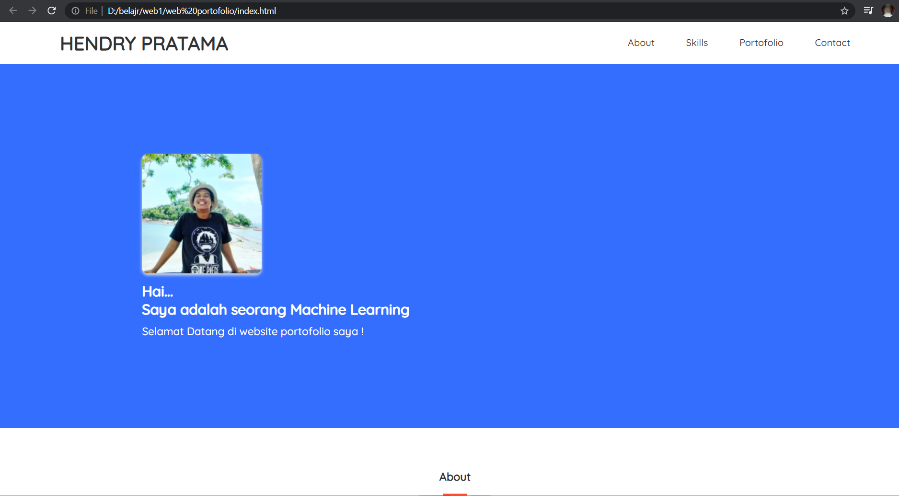
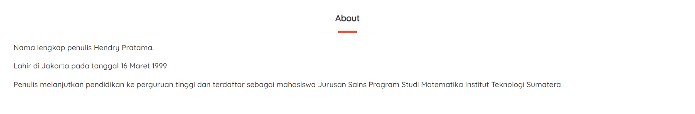
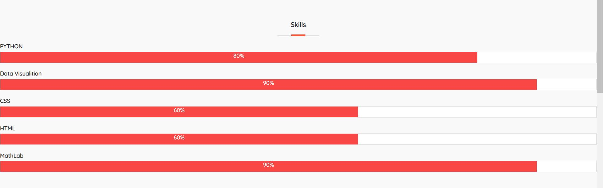
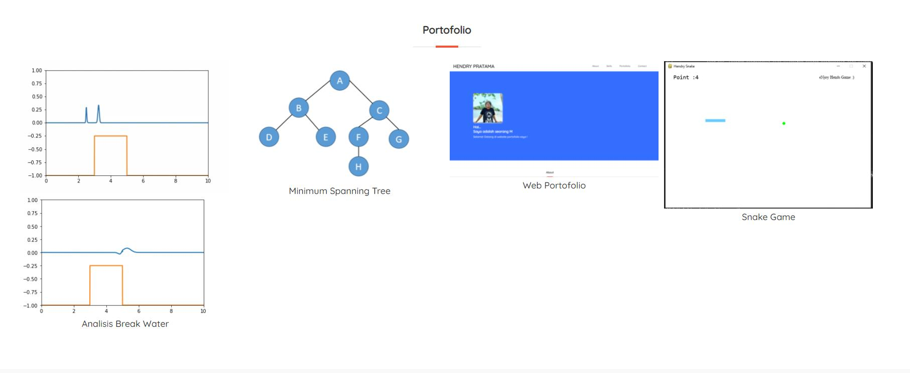
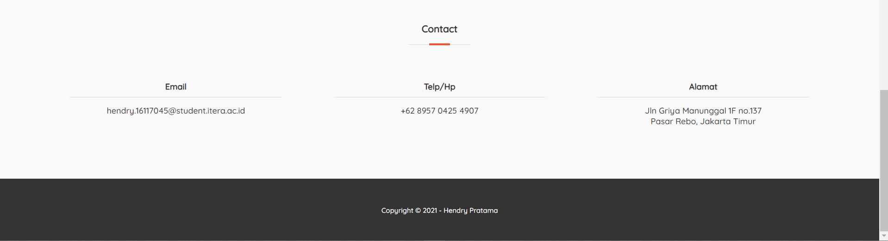

# web-Profile
Untuk menunjukkan profile seseorang dalam bentuk file, disini digunakan saya sebagai contoh

Disini akan ditunjukkan profil penulis sebagai berikut 

Dimana terdapat profil awal dan tulisan yang dapat bergerak. Sebagai berikut : 

Lalu untuk mengeksplor lebih lanjut dapat di scroll kebawah ataupun memilih sesuai pilihan dipojok kanan atas
sebagai berikut :

dimana about berisi informasi sebagai berikut : 
 

Skill berisi diagram batang  sebagai berikut : 

Portofolio berisi header projek yang telah dikerjakan :

Contact berisi informasi yang dapat digunakan untuk menghubungi penulis, serta dibagian paling bawah terdapat copyright 

